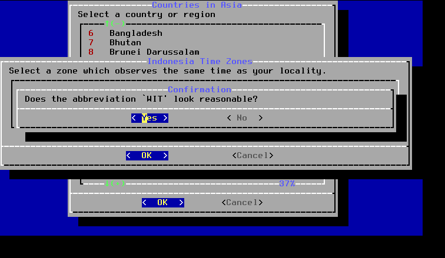

# Instalasi FreeBSD

Pada tutorial instalasi FreeBSD ini, saya menggunakan FreeBSD 13.3 STABLE amd64 di Virtual Machine Manager dengan RAM 1 GB, HDD 25 GB, adapter network NAT. ISO atau installer image FreeBSD nya dapat di download di [freebsd.org](https://download.freebsd.org/snapshots/amd64/amd64/ISO-IMAGES/13.3/).

Tampilan awal booting FreeBSD.
Tekan Enter.

Pilih Install.

Pemilihan keyboard, untuk default pilih **Continue with default keymap**.
Tekan Enter atau pilih Select.

Masukkan hostname, misal webserver.mazufik.net.

Pilihan komponen sistem.
Lepaskan tanda bintang (\*) pada ports Ports tree dengan menekan tombol space di keyboard. lalu tekan Enter.
Ports tree atau ports collection atau ports jika ingin melakukan instalasi aplikasi dari source code yang harus di compile terlebih dahulu. FreeBSD juga sudah menyediakan aplikasi yang sudah di compile atau paket biner.

Pemilihan metode partisi.
Pilih Auto UFS, lalu tekan Enter.

Gunakan pilihan Entire Disk, untuk penggunaan seluruh harddisk.
Tekan Enter.

Gunakan BSD untuk Partition Scheme dan tekan Enter.

Partition Editor, Pilih Finish dan tekan Enter.
Karena sebelum nya kita memilih Entire Disk, maka sistem akan otomatis membuatkan kita 2 partisi dari total harddisk 25GB yang sudah kita siapkan.

- Partisi pertama vtbd0a untuk partisi / (root), dengan kapasitas 24 GB dengan
  file system UFS (Unix File System)
- Partisi kedua vtbd0b untuk swap, dengan kapasitas 1 GB.

Konfirmasi partisi, pilih Commit dan tekan Enter.

Proses ekstrak komponen sistem akan dimulai, tunggu sampai selesai.

Masukkan password untuk root (administrator).

Konfigurasi jaringan. Pilih vtnet0 dan tekan Enter.

Gunakan IPv4, Tekan Enter / Yes.

Gunakan DHCP, Pilih No dan Tekan Enter.
Karena kita akan menggunakan IP Static untuk server kita nantinya.

Isikan IP Address, Subnet Mask dan Default Router sesuai dengan jaringan komputer masing-masing.

IPv6, Pilih No dan Tekan Enter.

Konfigurasi DNS, disini saya akan menggunakan DNS dari Google yaitu 8.8.8.8, teman-teman bisa menggunakan DNS dari jaringan public teman-teman.

Pemilihan zona waktu, Pilih Asia.

Pilih Negara tempat tinggal masing-masing, disini saya memilih Indonesia.

Pilih sesuai zona waktu indonesia. disini saya memilih West New Guinea karena saya tinggal di Indonesia Timur. teman-teman dapat menyesuaikan.

Konfirmasi zona waktu, pilih Yes dan tekan Enter.

Konfigurasi tanggal dan tekan Set Date.

Konfigurasi waktu dan tekan Set Time.

Untuk System Configuration, biarkan default dan tekan Enter.

Pasang tanda (\*) pada Disable Sendmail Service, untuk menonaktifkan Sendmail. Lalu tekan Enter.

Menambah sebuah User, Pilih Yes dan Enter.

Pembuatan user.
Masukkan User baru pada group wheel agar bisa menjadi root.

Final Configuration, pilih Exit dan tekan Enter.

Manual Configuration, pilih No dan tekan Enter.

Reboot, untuk restart sistem.
Jangan lupa lepas ISO/DVD installer.

Login, masukkan username yang sudah dibuat pada saat instalasi.
Menjadi root jalankan perintah su -, masukkan password root.
Perintah restart = reboot, shutdown = poweroff.

Setelah instalasi FreeBSD 13.3, space harddisk yang terpakai sebesar 1,8 GB dan RAM 180 MB.

